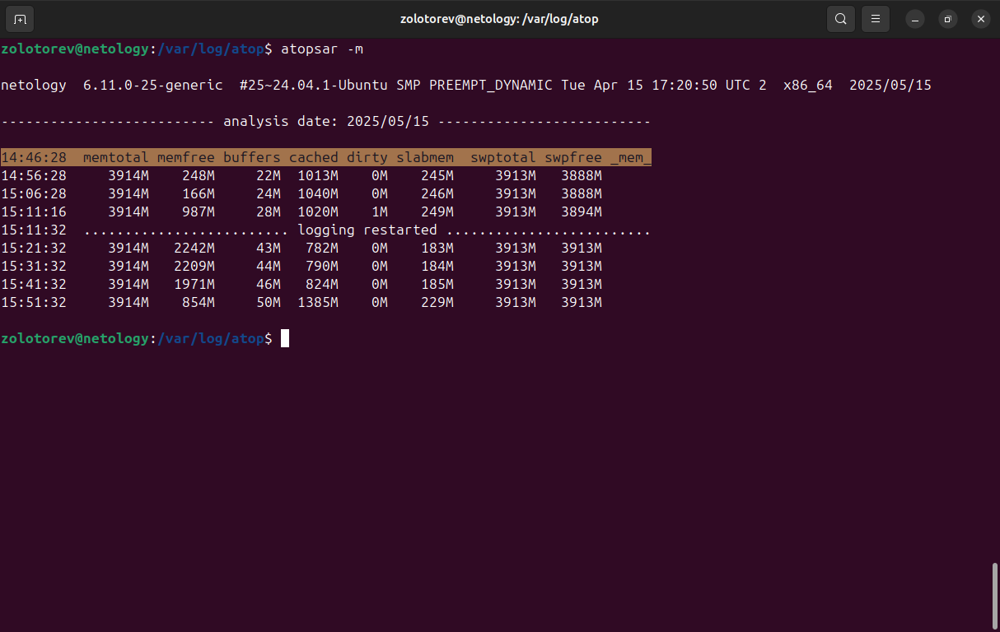
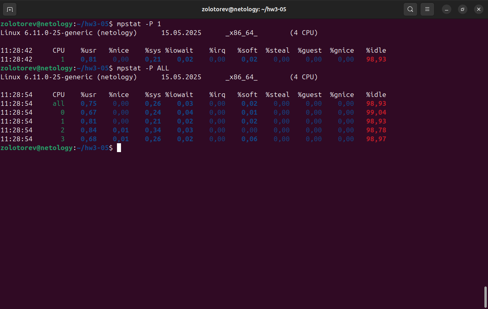

# hw3-05

### Задание 1

Выполните проверку системы при помощи команды top.

Выведите сортировку процессов по:

    памяти,
    времени работы,
    номеру,
    уровню потребления ресурсов.

Приведите ответ в виде снимков экрана.

### Решение 1

### Задание 2

Выполните проверку системы при помощи команды atop и atopsar.

Выведите сортировку процессов по:

    общей нагрузке — минимум по трём параметрам;
    загруженности HDD or SSD за указанный временной отрезок — 10 минут;
    загруженности RAM за указанный временной отрезок — 10 минут.

Сконфигурировать файл настроек atop — делать снимок памяти каждые полчаса.

Приведите ответ в виде снимков экрана.

### Решение 2

### Задание 3

При помощи команды mpstat и ключа P выведите информацию по:

    определённому процессору,
    всем процессорам.

Приведите ответ в виде снимков экрана.

### Решение 3

### Задание 4.

Выполните проверку системы при помощи команды pidstat.

    Выведите статистику по эффективности на основе имени процесса.
    Выведите полный путь процесса.

Приведите ответ в виде снимков экрана.

### Решение 4

